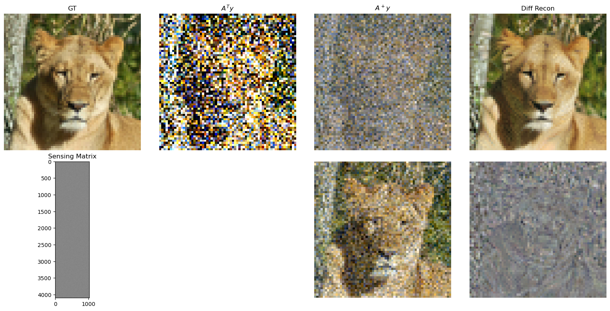
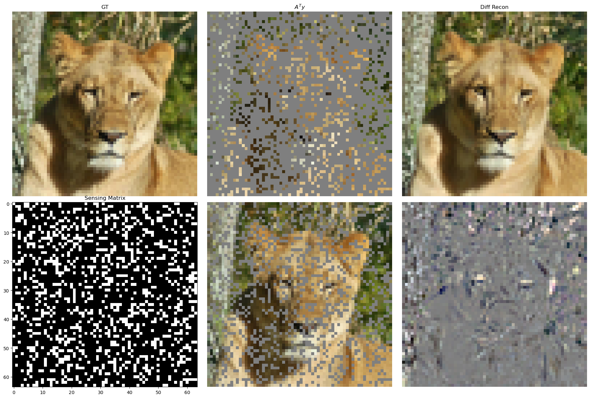
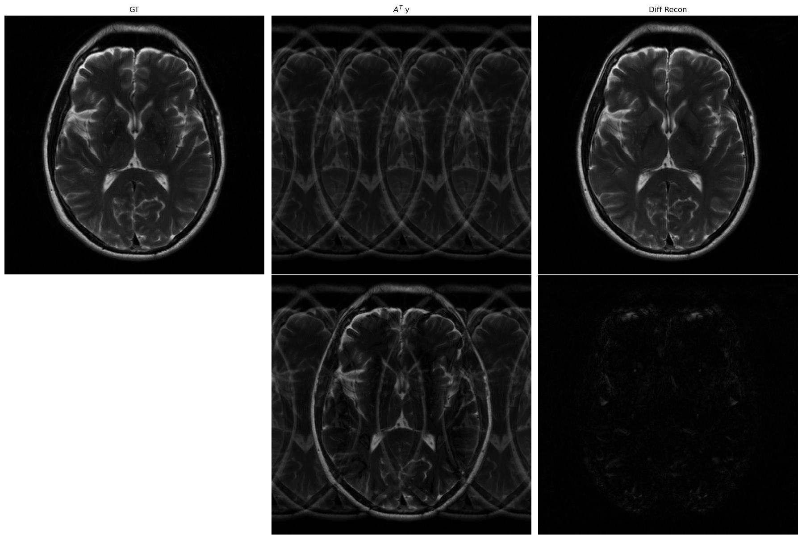

## Posterior Sampling for Inverse problems via Ambient Diffusion Models

This is an implemenation of posterior sampling with diffusion models to be used for solving inverse problems in computational imaging (e.g., MRI reconstruction, Image Deconvolution, Inpainting, Compressed Sensing, etc.). It is built atop the repo accompanying "Elucidating the Design Space of Diffusion-Based Generative Models" (https://arxiv.org/abs/2206.00364). See the repo for EDM here: https://github.com/NVlabs/edm 

## Getting started

First install the conda environment requirements

```.bash
conda env create -f environment.yml
```

activate conda environment

```.bash
conda activate edm
```
## RGB Image Experiments
Download model weights from: https://nvlabs-fi-cdn.nvidia.com/edm/pretrained/. Specifically, download "edm-afhqv2-64x64-uncond-ve.pkl".

Download an example 64x64 image from the validation parition of the AFHQ dataset: https://utexas.app.box.com/v/utcsilab-data/folder/237821411608.
 

Next, in "inference_general_photo.py" change the path for (1) the model weights and (2) the test data .pt file to their respective locations on your local machine.

To run the compressed sensing task run the following command
```.bash
python inference_general_photo.py --task compsens --R 4
```
if you then run the results viewer notbook you should see results that look similar to the following



To run the inpainting task run the following command
```.bash
python inference_general_photo.py --task inpaint --R 4
```
if you then run the results viewer notbook you should see results that look similar to the following



## MRI Recon Experiments
Download the model weights and example single coil kspace file from: https://utexas.app.box.com/v/utcsilab-data/folder/238168458833.

Next, in "inference_mri.py" change the paths for (1) the model weights and (2) the test data .pt file to their respective locations on your local machine.

To run an accelerated recon at R=4 run the following command

```.bash
python inference_mri.py --R 4
```
if you then run the results viewer notbook you should see results that look similar to the following

